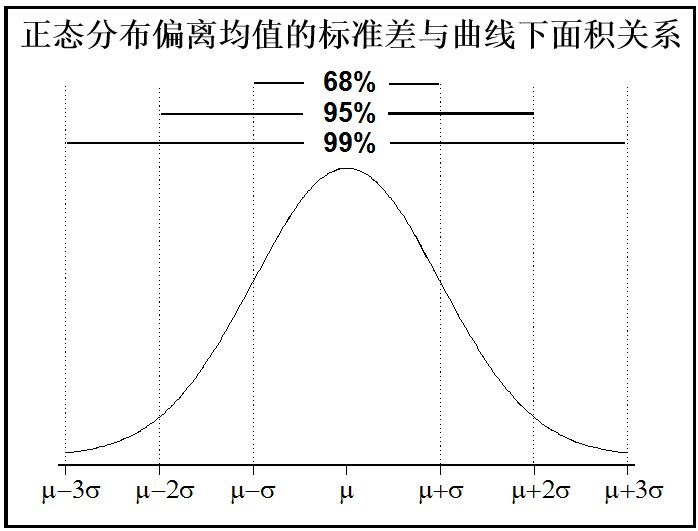
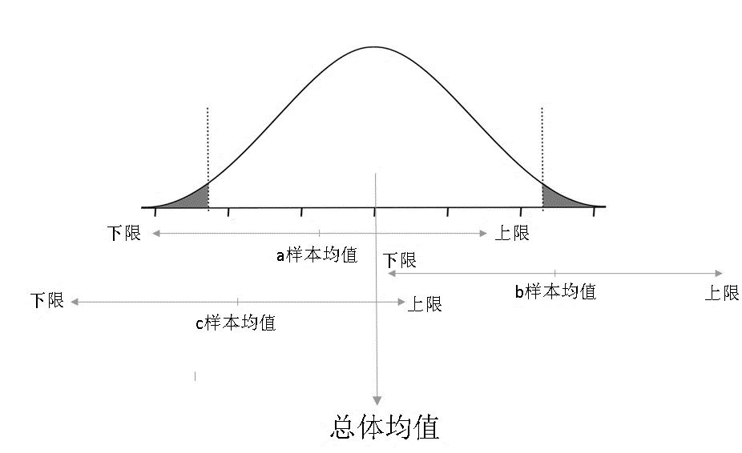
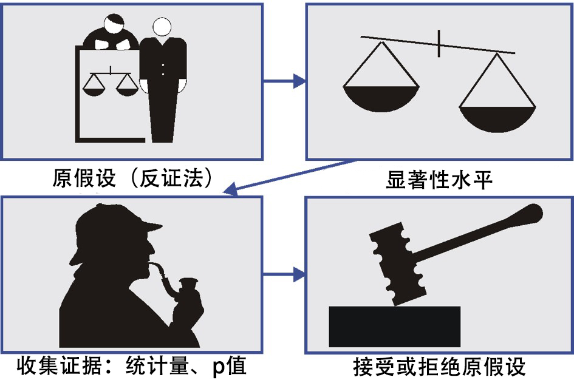
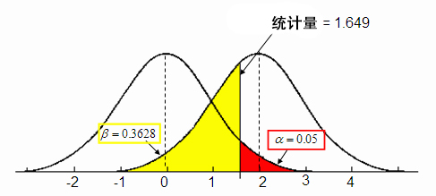
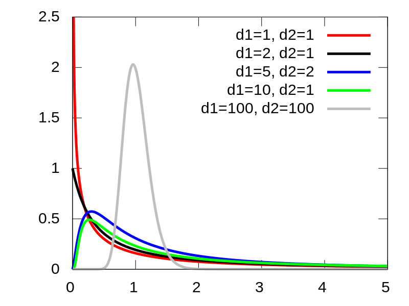
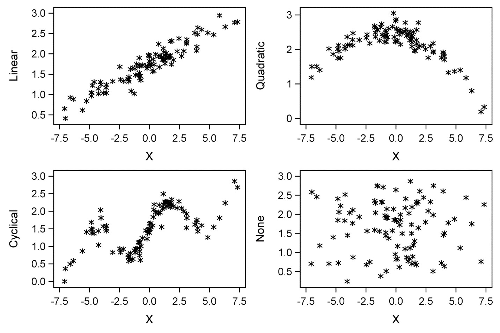
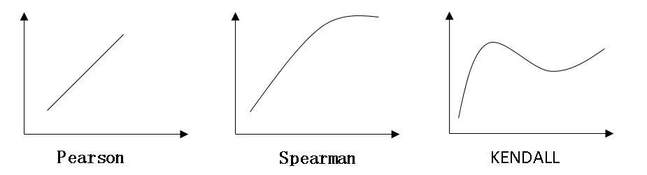
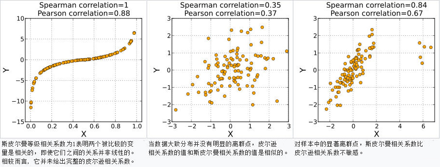
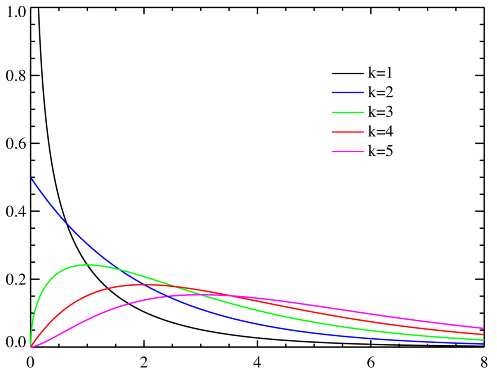

```{r setup, include=FALSE}
knitr::opts_chunk$set(echo = T)
```

## 主要内容

* 基本的统计学概念

* 假设检验与T检验

* 方差分析(分类变量和连续变量关系检验)

* 相关分析(两连续变量关系检验)

* 卡方检验(两分类变量关系检验)

# 基本的统计学概念

## 总体和样本

总体是要进行推断的人、物或事件的集合。检查整个总体的每个成员并不总是方便或可能的。例如有关人的特征的数据，每个人的特征是不可能完整得到的，但对从该总体中抽取的一部分人进行观测分析则是可能的。总体的这一子集称为样本，也就是说，样本与总体具有相同的分布，且样本间个体互相独立。  
回忆：事件相互独立： $P(AB)=P(A)P(B)$  
<center></center>
[wikipedia--sample](https://en.wikipedia.org/wiki/Sample_(statistics))  
如果样本是随机的并且足够大，则可以使用从样本中收集的信息对总体做出推断。也就是说样本是具有代表性的。

## 统计量

样本在一定程度上对总体具有代表性，而总体的统计量很难获取，故自然的用样本统计量估计总体统计量。  
常见的统计量有：均值(重心)、方差(集中程度)、标准差。 

\       |  总体参数    |   样本统计量  
------- | ------------ | --------------
均值    | $\mu$        | $\bar x_n$
方差    | $\sigma^2$   | $S^2$     
标准差  | $\sigma$     | $S$      

这里总体参数是常数，但是是未知的。而样本统计量是一个随机变量。这里我们所说的均值就是期望，只不过通常情况下我们认为样本中得到的每个观测都是等概的，所以期望可以由均值求得。

## 点估计

点估计是最直接的一种估计方式，简单得使用样本统计量（来自独立同分布随机变量iid）去估计总体统计量。点估计虽然简单，但有时结论却难以保证。

 $E(\bar X)=\mu$   |  $E(S)=\sigma$

由于一般情况下我们只能得到一个样本，所以：

$\bar X$ 估计 $\mu$   |  $S$ 估计 $\sigma$ 

样本的变异来自抽样的偏差。尤其是当总体分布比较广，个体比较多时，很容易因为某些不稳定因素造成抽样的偏差。

## 样本均值的统计量

* 样本均值用来估计总体均值，样本标准差$S=\sqrt{\frac{\sum_{i=1} (X_i-\bar X)^2}{n-1}}$ (这里n-1表示无偏估计)用来衡量样本的变异程度。
    + 样本标准差同样是一个分布，这个分布的期望值即均值用来估计总体标准差
* 样本均值分布的标准误差：
    + 衡量样本均值统计量的变异程度
    + 均值的标准误差随样本标准差的变化而变化

均值分布的标准差计算公式：$S_{\bar X}=\frac{\sigma}{\sqrt{n}}$。其中$\sigma$代表总体标准差，一般总体标准差是未知的，就可以根据样本标准差去点估计。即$S_{\bar X}=\frac{S}{\sqrt{n}}$

## 样本均值分布

```{r, fig.height=3}
library(ggplot2);nosim<-10000
dat<-data.frame(x=c(sample(1:6,nosim,replace=T),
        apply(matrix(sample(1:6,nosim*2,replace=T),nosim),1,mean),
        apply(matrix(sample(1:6,nosim*3,replace=T),nosim),1,mean),
        apply(matrix(sample(1:6,nosim*10,replace=T),nosim),1,mean)),
  size=factor(rep(c(1,2,3,10),rep(nosim,4))))
g<-ggplot(dat,aes(x=x,fill=size))+geom_histogram(alpha =.20,binwidth=.25,colour="black") 
g+facet_grid(.~size)
```

## 样本标准差分布

```{r,fig.height=3}
nosim<-10000
dat<-data.frame(x=c(apply(matrix(rnorm(nosim*10),nosim),1,var),
          apply(matrix(rnorm(nosim*20),nosim),1,var),
          apply(matrix(rnorm(nosim*50),nosim),1,var)),
    n=factor(rep(c("10","20","50"),c(nosim, nosim, nosim))))
ggplot(dat,aes(x=x,fill=n))+geom_density(size=1,alpha=.2)+geom_vline(xintercept=1,size=1) 
```

## 验证标准误差

Poisson(4)的标准差是4，n个个体的均值得到的分布标准误差是$2/\sqrt{n}$
```{r, collapse=T}
nosim<-1000;n<-10
sd(apply(matrix(rpois(nosim*n,4),nosim),1,mean))
2/sqrt(n)
```

## 中心极限定理

样本均值本身就是一个独立同分布统计量，当样本量增大是，近似服从正态分布的。即在样本量足够大的时候，抽样多次，产生的多个均值服从正态分布。这个正态分布的均值就等于总体分布的均值。

```{r, fig.height=2.5}
library(ggplot2);nosim <- 10000; n<-10 ##10个样本求均值
dat<-data.frame(x=c(rnorm(nosim),apply(matrix(rnorm(nosim*n),nosim),1,mean)),
    what=factor(rep(c("Obs","Mean"),c(nosim,nosim))))
ggplot(dat,aes(x=x,fill=what))+geom_density(size =1,alpha =.2); 
```

## 中心极限定理：验证

去理解中心极限定理CLT的最好的方式是认为: $\bar X_n\stackrel{iid}{\sim}N(\mu,\sigma^2/n)$  

试验：掷一枚不均匀的硬币，假设抛出正面的概率$p=0.9$，那么：  

* $E[X_i]=p=0.9$，$Var(X_i)=p(1-p)=0.09$
* 均值的标准误差$S_{\bar X}=\sqrt{p(1-p)/n}=0.3/\sqrt n$
* 即：$\frac {\bar X_n-0.9}{0.3/\sqrt{n}}\stackrel{}{\sim}N(0,1)$

[Galtonboard](https://www.youtube.com/watch?v=epq-dpMJIxs)

***
### 验证结果

```{r,fig.height=2.5,fig.width=5,fig.align='center'}
nosim<-1000;cfunc<-function(x,n) sqrt(n)*(mean(x)-0.9)/sqrt(.1*.9)
dat <- data.frame(
  x=c(apply(matrix(sample(0:1,prob=c(.1,.9),nosim*10,replace=TRUE),nosim),1,cfunc,10),
    apply(matrix(sample(0:1,prob=c(.1,.9),nosim*20,replace = TRUE),nosim),1,cfunc,20),
    apply(matrix(sample(0:1,prob=c(.1,.9),nosim*30,replace = TRUE),nosim),1,cfunc,30)),
  size=factor(rep(c(10,20,30),rep(nosim,3))))
g<-ggplot(dat,aes(x=x,fill=size))+geom_histogram(binwidth=.3,aes(y=..density..)) 
g<-g+stat_function(fun=dnorm,size=1)
g+facet_grid(.~size)
```

## 置信区间

置信区间的意思就是，如果反复进行100次抽样，100次抽样的置信区间中，应该有95次总体的均值在区间之内。   
<center></center>

大体上讲，在标准正态分布中(函数pnorm(),qnorm())：

* 1,2,3倍标准差包围的概率密度的比率分别是68%,95%,99%。  
* 1.28,1.645,1.96,2.57对应的是$90^{th}$,$95^{th}$,$97.5^{th}$,$99.5^{th}$。

## 区间估计示例
<center></center>  
图中演示了总体分布以及三个样本均值的上下两倍标准误范围区间（95%的保证程度）。对于a、c样本，区间范围包含了总体均值，而对于样本b，均值偏离总体均值太远以至于置信区间不包含总体均值，即抽样得到b样本的概率小于5%，此时如果我们能够容忍5%的错误率，就有理由说b样本不是出自该总体。

## 置信区间计算

总体均值的置信区间就可以根据样本求得的均值和标准误，以及中心极限定理来确定：  
$$\bar x \pm z*S_{\bar x}$$
其中：  

* $\bar x$：样本均值
* $z$： $z$统计量，标准正态分布对应的分位点
* $S_{\bar x}$：均值的标准误差

## 置信区间模拟

```{r}
n<-20; pvals<-seq(.1,.9,by =.05);nosim<-1000
coverage<-sapply(pvals,function(p){
  phats<-rbinom(nosim,prob =p,size=n)/n
  ll<-phats-qnorm(.975)*sqrt(phats*(1-phats)/n)
  ul<-phats+qnorm(.975)*sqrt(phats*(1-phats)/n)
  mean(ll<p&ul>p)
  })
```
```{r}
g<-ggplot(data.frame(pvals,coverage),aes(x=pvals,y=coverage))
g<-g+geom_line(size=1)+geom_hline(yintercept=0.95)+ylim(.75, 1.0)
```

## 画出模拟图

```{r,fig.align='center',fig.height=3,,fig.width=5,echo=F}
g
```

有很少的点真正覆盖95%的区间，是因为在此案例中，中心极限定理在特定的$N$和真实概率$p$下没有那么精确。加大$N$会得到改善。  
（加两个成功和失败，重新计算概率$p=\frac{X+2}{n+4}$，会使覆盖情况得到较大的改观，Agresti/Coull interval）

***
### 案例

```{r fig.height=2.4,collapse=T}
house_price_gr<-read.csv("data/house_price_gr.csv")
house_price_gr[runif(2,1,nrow(house_price_gr)),]
attach(house_price_gr); par(mfrow=c(1,2),mar=c(4,4,1,4))
hist(rate,prob=T,main="Distrabution of 住宅价格增长率")
lines(density(rate));qqnorm(rate);qqline(rate); par(mfrow=c(1,1))
```

***
### 案例

```{r collapse=T}
mean(rate)
se<-sd(rate)/sqrt(length(rate));se
LB<-mean(rate)-1.96*se; UB<-mean(rate)+1.96*se; c(LB,UB)
```

自定义函数以改变显著性水平：
```{r collapse=T}
confint<-function(x,alpha=0.05)
{ n<-length(x);xb<-mean(x)
  tmp<-(sd(x)/sqrt(n))*qnorm(1-alpha/2)
  data.frame(mean=xb,LB=xb-tmp,UB=xb+tmp)}
confint(rate,0.01)
```

# 假设检验和T检验

## 假设检验

<center></center>  

## 假设检验的两类错误

备择假设的形式一般是$<$, $>$ 或者 $\neq$

检验的\\真实的 |  $H_0$为真  |   $H_0$为假
-------------- | ----------- | -------------
接受原假设     |正确         |II类错误
拒绝原假设     |I类错误      |正确


## 显著性水平和效度

<center></center>  

## 先验知识：T置信区间

样本量比较小的时候一般使用T分布，T置信区间和之前讨论的正态分布置信区间类似：$E_{st}\pm TQ \times SE_{Est}$。t分布在样本量很大时非常近似于正态分布。当一个案例中t分布和正态分布都可以使用时使用t分布。t置信区间：$\bar x \pm t_{n-1}*S_{\bar x}$

使用manipulate包来观察t分布在不同自由度下的变化
```{r,eval=F}
library(manipulate);k<-1000
xvals<-seq(-5,5,length=k)
myplot<-function(df){
  d<-data.frame(y=c(dnorm(xvals),dt(xvals,df)),x=xvals,
                  dist=factor(rep(c("Normal","T"),c(k,k))))
  g<-ggplot(d,aes(x=x,y=y))+geom_line(size=2,aes(colour=dist))
  g}
manipulate(myplot(mu),mu=slider(1,30,step=1)) 
```

## 计算不同样本类型的T置信区间

配对样本T置信区间，使用自带的sleep数据:
```{r,collapse=T}
data(sleep)
g1<-sleep$extra[1:10];g2<-sleep$extra[11:20];diff<-g2-g1
mn<-mean(diff);s<-sd(diff);n<-10
mn+c(-1,1)*qt(0.975,n-1)*s/sqrt(n)
t.test(diff)$conf[1:2]
t.test(g2,g1,paired=T)$conf[1:2]
t.test(extra~I(relevel(group,2)),paired=T,data=sleep)$conf[1:2]
```

## 同方差独立组的T置信区间

对于两组独立同分布，且样本量不同的样本$X_i,Y_i$(对应样本量$n_x,n_y$)，不能使用配对检验，注意这里我们假设两样本同分布，即总体方差相同，但是实际上我们得到的是样本方差，实际数值未必相同。

$(1-\alpha) \times 100 \%$ 水平下，$\mu_y-\mu_x$的t置信区间：
$\bar Y-\bar X \pm t_{n_x + n_y - 2, 1 - \alpha/2}S_p\left(\frac{1}{n_x} + \frac{1}{n_y}\right)^{1/2}$  
其中：$S_p^2 = \{(n_x - 1) S_x^2 + (n_y - 1) S_y^2\}/(n_x + n_y - 2)$

注意使用配对比不使用配对方差包含的信息更多，即在能配对的情况下，使用配对得到的结果更准确。
```{r,collapse=T}
t.test(extra~I(relevel(group,2)),paired=F,data=sleep)$conf[1:2]
```

## 配对数据描述

```{r fig.height=4}
library(ggplot2)
g<-ggplot(sleep,aes(x=group,y=extra,group=factor(ID)))
g<-g+geom_line(size=1,aes(colour=ID))+geom_point(size=10,pch=21,fill="salmon",alpha=.5)
g
```


## 异方差独立组的T置信区间

如果不确定两组样本是否同方差，则可以假设两组样本异方差，对应计算方法如下：

$$\bar Y - \bar X \pm t_{df} \times \left(\frac{s_x^2}{n_x} + \frac{s_y^2}{n_y}\right)^{1/2}$$

其中自由度：$df=\frac{\left(S_x^2 / n_x + S_y^2/n_y\right)^2}{\left(\frac{S_x^2}{n_x}\right)^2 / (n_x - 1) +\left(\frac{S_y^2}{n_y}\right)^2 / (n_y - 1)}$

## 单样本T检验

通过单样本数据判断总体均值是否与假设的检验值之间存在显著性差异，是对总体均值的假设检验。检验步骤如下：  

* 原假设：$H_0$：总体均值$\mu$等于$\mu_0$
* 显著性水平：选取常用的$\alpha=5\%$
* 通过样本数据计算t统计量：$$t=\frac{(\bar x-\mu_0)}{S_{\bar x}}$$
* 通过$t$统计量求得相应的$p$值来判断是否拒绝原假设

## R代码

```{r}
t.test(rate,mu=0.1)
```

## 多变量关系检验方法综述

$X$\\$Y$                |分类（包含名义和等级）             |连续
------------------------|-----------------------------------|-----------------------------------
分类（包含名义和等级）  |交叉表（列联表）分析               |两样本T检验,方差分析(多分类，ANOVA)
连续                    |两样本T检验,方差分析(多分类，ANOVA)|相关分析

## 两样本T检验

T检验用于检测均值的差异性，单样本T检验检验的是假设的总体均值和样本均值的差异；双样本T检验检验的是两个样本均值的差异是否显著。常用于检验某二分类变量区分下的某连续变量是否有显著差异。  
这里我们分析用到的数据是信用卡数据creditcard_exp.csv，变量"avg_exp"表示信用卡消费，"gender"表示性别(男=1)。  

```{r,collapse=TRUE}
creditcard_exp<-read.csv("data/creditcard_exp.csv")
creditcard_exp<-na.omit(creditcard_exp)
creditcard_exp$gender<-as.factor(creditcard_exp$gender)
creditcard_exp$edu_class<-as.factor(creditcard_exp$edu_class)
creditcard_exp[runif(3,1,nrow(creditcard_exp)),c("avg_exp","gender")]
```

## 数据分组汇总

```{r,collapse=TRUE,fig.height=2.8}
attach(creditcard_exp);par(mar=c(4,4,1,4))
tapply(avg_exp, gender, summary);boxplot(avg_exp~gender)
```

## 前提条件

双样本T检验需要满足的前提条件：  
观测之间相互独立；每组均服从正态分布  
这里需要注意两组方差的异同，方差相同与方差不同对应的T统计量的计算公式是不一样的。方差的异同可以通过方差齐性检验判断：  
原假设：两个样本方差相同  
F统计量：$F=\frac{max(S_1^2,S_2^2)}{min(S_1^2,S_2^2)}$ 服从F分布:[F-distribution(wiki)](https://en.wikipedia.org/wiki/F-distribution)  
<center></center>

## 双样本T检验流程

* 根据两样本数据或者是分组变量计算相应的均值
* 进行方差齐性检验
* 进行双样本T检验，根据方差齐性检验的结果设置T检验的参数

***
### R代码实现: 方差齐性检验

```{r}
var.test(avg_exp~gender)
```

***
### R代码实现：T检验

```{r}
t.test(avg_exp~gender,var.equal=T)
```

# 方差分析

## 方差分析

方差分析是数据分析中最常见的统计模型，用于探讨连续型变量和分类型变量之间的关系，当分类型变量的因子中包含等于或超过三个类别的情况下，检验其各类别见平均数是否相等的统计模式。  

方差分析主要依靠F-分布为概率分布的依据，利用平方和(sun of square)与自由度(degree of freedom)所计算的组间和组内均方(mean of square)估计出F值。  

含有多个分类时也可以用T检验两两分析，但是两两分析会导致多重比较，而致使第一类错误的机会升高。因此比较多组平均数是否有差异主要用方差分析。  

[方差分析(wiki)](https://zh.wikipedia.org/wiki/%E6%96%B9%E5%B7%AE%E5%88%86%E6%9E%90)

## 方差分析前提假设

广义而言，方差分析一共有三大前提假设（与T检验类似）：

* 各组样本均服从正态分布或逼近正态分布。
* 各组样本必须相互独立
* 各组的方差必须相等

## 方差分析的基本数据  

水平  |        观测值                 |总体
------|-------------------------------|--------------------
$M_1$ | $x_{11},x_{12},...,x_{1n_1}$  |$N(\mu_1,\sigma^2)$ 
$M_2$ | $x_{21},x_{22},...,x_{2n_2}$  |$N(\mu_2,\sigma^2)$ 
...   |...                            |...
$M_k$ | $x_{k1},x_{k2},...,x_{kn_k}$  |$N(\mu_k,\sigma^2)$ 

其中$x_{ij}$表示第$i$个水平下(共$k$个)第$j$次试验结果，每个水平$M_i$包含的观测$x_{n_i}$可能不同(即每个水平长度不等)。每个水平的方差均为$\sigma^2$  

## 方差分析流程

原假设：$H_0:\mu_1=\mu_2=...=\mu_k$  
备择假设：$H_1:\mu_i(i=1,2,...,k)$不全相等

构造统计量：$x_{ij}$取值源自随机抽样产生的误差以及不同分类水平产生的误差，要区分这两种差异需要将总离差平方和进行分解：
$$SS_T=\sum_{i=1}^k \sum_{j=1}^{n_i} (x_{ij}-\bar x)^2 \\ = \sum_{i=1}^k \sum_{j=1}^{n_i} (x_{ij}- \bar {x_{n_i}})^2 +  \sum_{i=1}^k n_i (\bar {x_{n_i}} - \bar x)^2 = SS_E + SS_M $$ 

其中$SS_E$是组内离差平方和，$SS_M$是组间离差平方和。

## 构造F统计量

如果原假设成立，则组内均方$\frac{SS_E}{n-k}$与组间均方$\frac{SS_M}{k-1}$之间的差异不会太大（可以证明这两个均方均为方差$\sigma^2$的无偏估计量，这里从略）。如果组间均方显著大于组内均方，就说明水平对观测变量的影响显著。所以观测均值在不同水平下的差异转化为比较组间均方和组内均方之间差异的大小。  

于是构造F统计量如下：$$F=\frac{SS_M/(k-1)}{SS_E/(n-k)} \stackrel{}{\sim} F(k-1,n-k) $$  
给定显著性水平$\alpha$，从而判断是否能够拒绝原假设。

***
### R代码实现：描述

数据集中：edu_class表示教育等级：小学及以下开通=0，中学=1，本科=2，研究生=3

```{r,fig.height=3}
par(mar=c(4,4,1,4))
boxplot(avg_exp~edu_class)
```

***
### R代码实现：分析

```{r}
anova(lm(avg_exp~edu_class))
```

## 方差分析的另一种表示方法

方差分析的另一种表示方法类似于回归: $$Y_i=\mu+\tau_i+\epsilon_i$$
单因素方差分析：$因变量=原假设成立设定的均值+均值的变更效应+残差$  
$i$表示分类自变量的第$i$个水平。  

多因素方差分析：目标变量都是连续变量，多因素指的是多个分类变量。多个分类变量就涉及到交互项的问题：
$$Y_i=\mu+\alpha_i+\tau_j+\epsilon_{ij}$$
$$Y_i=\mu+\alpha_i+\tau_j+\alpha_i \times \tau_j+\epsilon_{ij}$$

***
### R代码实现：描述

```{r,fig.height=3}
mv<-data.frame(0:3,tapply(avg_exp,list(edu_class,gender),mean))
names(mv)<-c("educlass","female","male")
par(mar=c(4,4,1,4))
plot(as.numeric(edu_class)-1,avg_exp,col=gender,xlab="教育等级",ylab="不同等级下的均值")
legend("topleft",pch=1,col=c("red","black"),legend=c("男","女"))
lines(mv$educlass,mv$female,type='l')
lines(mv$educlass,mv$male,type='l',col="red")
```

***
### R代码实现：分析

```{r}
anova(lm(avg_exp~edu_class+gender+edu_class*gender))
```

## 交互项判断

多因素方差分析增加交互项的方法：

* 加入所有交互项，然后观察显著性
* 只研究重点研究的变量，这时候就要区分变量：
    + 研究变量，可以人为改变的待研究的变量，比如教育水平
    + 控制变量，不易改变，不同等级间需要分开进行研究的，比如性别，只研究男或女
    + 调节变量，控制变量和研究变量的交互项
    
控制变量之间不做交互作用，比如性别和年龄段。交互作用一般是研究变量和控制变量之间。
    
# 相关分析

## 相关分析

观察两连续型变量之间的关系：  
<center></center> 

## 相关系数

相关关系是一种不完全确定的随机关系，当一个变量的数值被确定后，与之相应的另一个变量的值虽然不能确定，但仍然按照某种依赖关系在一定范围内变化。  

简单相关分析是研究两变量之间相关关系的方法。按照变量性质的不同，所采用的相关分析方法也不同。对于连续变量的线性相关分析，通常采用person相关系数来描述变量之间的相关关系；对于有序变量，常使用spearman秩相关系数，其不使用变量观测的取值信息而使用排序信息进行相关分析，不用假设变量服从正态分布，所以其使用比较广泛。

<center></center>

## 皮尔逊积秩相关系数

统计学中，皮尔逊积秩相关系数用于度量两变量之间$X$和$Y$的线性相关，数值介于$-1$和$1$之间，也被称为"皮尔逊相关系数r"  

<center></center>  
几组(x, y)的点集，以及各个点集中x和y之间的相关系数。我们可以发现相关系数反映的是变量之间的线性关系和相关性的方向，而不是相关性的斜率，也不是各种非线性关系。([皮尔逊秩积相关系数](https://zh.wikipedia.org/wiki/%E7%9A%AE%E5%B0%94%E9%80%8A%E7%A7%AF%E7%9F%A9%E7%9B%B8%E5%85%B3%E7%B3%BB%E6%95%B0))

## 皮尔逊相关系数定义

两变量之间的总体相关系数定义为两变量之间协方差和标准差的商： 

$\rho_{X,Y}=\frac{cov(X,Y)}{\sigma_X \sigma_Y}=\frac{E[(X-\mu_X)(Y-\mu_Y)]}{\sigma_X \sigma_Y}$  

实际应用中，一般使用样本相关系数代替总体相关系数:  

$r=\frac{\sum_{i=1}^{n} (X_i-\bar X)(Y_i-\bar Y)}{\sqrt{\sum_{i=1}^{n} (X_i-\bar X)^2} \sqrt{\sum_{i=1}^{n} (Y_i-\bar Y)^2}}=\frac{1}{n-1}\sum_{i=1}^{n} (\frac{X_i-\bar X}{\sigma_X})(\frac{Y_i-\bar Y}{\sigma_Y})$  

皮尔逊相关系数用于两变量均服从正态分布的连续变量，并且变量成对，用于描述两变量之间的线性关系。

## 相关系数大小的解释

目前已经有了一些相关系数的解释，但是从某种意义上说，所有这些标准都可能武断和不严格的，对相关系数的解释依赖于具体的应用背景和目的。如果是用高性能的仪器来验证一个物理定律，$0.9$可能是很低的，但如果应用在社会科学中，由于社会科学受到各种复杂多变因素影响，$0.9$是很高的。下面给出社会科学中比较常见的解释：  

对于样本相关系数r的绝对值\|r\|:  

* $[0.00,0.20)$    | 极低相关
* $[0.20,0.40)$    | 低度相关
* $[0.40,0.60)$    | 中度相关
* $[0.60,0.80)$    | 高度相关
* $[0.80,1.00)$    | 极高相关

## 相关系数检验

由于一般情况下计算的是样本相关系数，并不能代表总体，所以需要进行假设检验，以判断r是否由抽样误差所致还是两变量间确实存在相关关系。检验步骤：  

* 原假设$H_0: \rho=0$，备择假设$H_1: \rho \neq 0$  
* 设置显著性水平：$\alpha=0.05$，如果从$\rho=0$的总体中取得某$r$值的概率小于等于$0.05$，则拒绝原假设，认为该$r$值不是来自$\rho=0$的总体。
* 统计量构建：对于近似正态分布的数据，皮尔逊相关系数的样本分布近似于自由度为$n-2$的$t$分布。$t=\frac{|r-0|}{\sqrt{\frac{1-r^2}{n-2}}}=r \sqrt{\frac{n-2}{1-r^2}}$，然后得到相应的$p$值。（样本量很大时p值会失真）

## 斯皮尔曼等级相关系数

斯皮尔曼等级相关系数是衡量两个变量的依赖性的非参数指标。如果数据中没有重复值，并且两个变量完全相关时，系数值为$1$或$-1$。  

<center></center>

[斯皮尔曼等级相关系数](https://zh.wikipedia.org/wiki/%E6%96%AF%E7%9A%AE%E5%B0%94%E6%9B%BC%E7%AD%89%E7%BA%A7%E7%9B%B8%E5%85%B3%E7%B3%BB%E6%95%B0#cite_note-myers2003-1)

## 斯皮尔曼相关系数定义

斯皮尔曼相关系数被定义为等级变量之间的皮尔逊相关系数，对于样本量为$n$的样本，$n$个原始数据$X_i,Y_i$被转换成等级数据$x_i,y_i$，然后用计算皮尔逊相关系数（针对样本）的方法计算。

智商，$X_i$|每周花在电视机上的小时，$Y_i$|等级$x_i$|等级$y_i$|两等级列差值$d_i$|$d_i^2$
-----------|-----------------------------|-------------------|-----------------|--------
86         |0                            |1        |1        |0                |0
100        |27                           |2        |3        |-1               |1
106        |7                            |3        |2        |1                |1

相关系数$\rho$为：$\rho=\frac{\sum_{i} (x_i-\bar x)(y_i-\bar y)}{\sqrt{\sum_{i} (x_i-\bar y)^2} \sqrt{\sum_{i} (y_i-\bar y)^2}}=1-\frac{6 \sum {d_i^2}}{n(n^2-1)}$ 系数检验与皮尔逊积秩相关系数检验相同。

***
### R代码实现：描述

```{r,fig.height=3.5}
par(mar=c(4,4,1,4));plot(Income,avg_exp)
abline(lm(avg_exp~Income))
```

***
### R代码实现：分析

```{r}
##相关性分析："pearson","spearman","kendall"
cor.test(Income,avg_exp,method='pearson')
```

## 矩阵图

进行相关分析除了可以通过两两变量的相关系数进行分析，也可以通过散点图矩阵和相关矩阵图对多个变量之间的相关关系有一个直观和全面的了解。在图中可以通过其中的线性拟合线查看其中线性或非线性的变化规律。

常用于绘制散点图矩阵的函数有graphics（自带包）中的pairs()函数以及car包中的scatterplotMatrix()函数。

***
### R代码实现散点图

```{r,fig.height=4}
par(mar=c(4,4,0,4))
pairs(~avg_exp+Age+Income+dist_home_val+dist_avg_income,data=creditcard_exp,
      panel=panel.smooth)
```

***
### R代码实现散点图

```{r}
library(car);par(mar=c(4,4,0,4))
scatterplotMatrix(~avg_exp+Age+Income+dist_home_val+dist_avg_income|gender)
```

## 相关矩阵图

散点图在小范围内就会变的很拥挤，而且矩阵中变量很多也不便于观察。就可以做相关矩阵图来查看，相关矩阵图是基于变量间的相关关系大小，通过某些直观的可视化方式表现出不同变量组合间相关关系的图形。常用于绘制相关矩阵图的函数有corrgram包中的corrgram()函数以及corrplot包中的corrplot()函数。  

corrplot()函数中需要设置的参数主要有method、type、col、order。其中method可取值：circle（圆形，默认）、square（方形）、ellipse（椭圆）、number（数字）、pie（饼图）、shade（阴影）。type用来设置图形的显示区域：full（全部，默认）、upper（上三角）、lower（下三角）。col表颜色。order指定相关系数变量的排序方式。  
注意函数对象是一个经过cor()处理的相关系数矩阵（对于一般的矩阵需要用is.corr=FALSE进行限定）。

***
### R代码实现相关图矩阵

```{r,fig.height=4}
library(corrplot) ##使用不同的method绘制矩阵图
meths<-c("circle","square","ellipse","number","pie","color")
credit<-creditcard_exp[,c("avg_exp","Age","Income","dist_home_val","dist_avg_income")]
par(mfrow=c(2,3));temp<-mapply(function(x){corrplot(cor(credit),method=x)},meths)
```

## corrgram()绘制相关图矩阵

corrgram()中需要设置的参数有panel（lower.panel、upper.panel）、order、col.regions。panel设置面板形状，可以通过upper.panel（上三角面板）和lower.panel（下三角面板）分别设置，常用参数有：panel.pie饼图、panel.shade阴影图、panel.ellipse椭圆图、panel.pts散点图、NULL不绘制。order=TRUE用来设置排序处理。  

我们使用R自带数据集mtcars，这个数据集变量较多，可以方便查看图形效果。

```{r}
head(mtcars,2)
```

***
### R代码实现相关图矩阵

```{r,fig.width=5.5,fig.height=4}
library(corrgram)
corrgram(mtcars,order=T,lower.panel=panel.pie,upper.panel=panel.shade)
```

# 卡方检验

## 卡方检验

卡方检验主要用于检验两个分类变量之间的关系，如果其中一个变量的分布随着另一个变量的水平不同而发生变化时，两个分类变量就有关系，反之则没有关系。也可以通过独立性来理解，如果两个分类变量相互独立，则没有关系；反之亦然。

可以通过交叉表进行初步的观察，然后使用卡方检验来说明是由有统计学上的意义。

我们这里使用的数据是accepts.csv，是一份汽车贷款违约数据,被解释变量（因变量）为是否违约(bad_ind)，我们需要观察的解释变量是是否破产(bankruptcy_ind)。

***
### R代码实现：描述

```{r,collapse=T}
accepts<-read.csv("data/accepts.csv",stringsAsFactors=F)
attach(accepts)
table(bankruptcy_ind,bad_ind)
xtabs(~bankruptcy_ind+bad_ind)
```

***
### R代码实现：描述

```{r,collapse=T}
library(prettyR);xtab( ~bankruptcy_ind+bad_ind)
```

## 卡方检验

卡方检验的基本思想就是比较期望频数和实际频数的一致性，实际频数指单元格内实际的观测数量，期望频数指行变量某类别与列变量某类别互相独立的时候的频数。期望频数的计算：期望频数=(行总/样本量×列总/样本量)\*样本量=(行总\* 列总)/样本量。  
在假设两分类变量独立的情况下，构造卡方统计量：$\chi^2=\sum_{i=1}^R \sum_{j=1}^C \frac{(Obs_{ij}-Exp_{ij})^2}{Exp_{ij}}=n[(\sum_{i=1}^R \sum_{j=1}^C \frac{Obs_{ij}^2}{n_R n_C)})-1]$  

自由度：$\nu=(R-1)(C-1)$

其中$Obs_{ij}$为实际频数，$Exp_{ij}$为期望频数，且$Exp_{ij}=\frac{n_R n_C}{n}$，$n$为所有频数之和，$n_R$为每行的频数之和，$n_C$为每列的频数之和。

## $\chi^2$分布

有$\chi^2$定义可知，可以通过检验$\chi^2$统计量来描述实际频数和期望频数的接近程度，卡方分布的概率密度函数：  
<center></center>  

当自由度趋近于无穷大时，$\chi^2$分布接近正态分布。

***
### R代码实现：分析

```{r}
chisq.test(x=accepts$bankruptcy_ind,y=accepts$bad_ind)
```
```{r,results="hide"}
xtab( ~bankruptcy_ind+bad_ind,data=accepts,chisq = T)
```

***
### R代码实现：分析

```{r,echo=F}
xtab( ~bankruptcy_ind+bad_ind,data=accepts,chisq = T)
```


