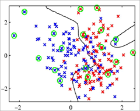
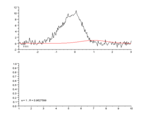
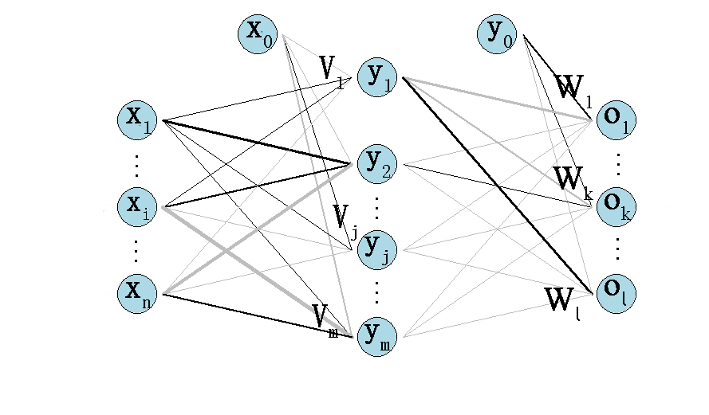
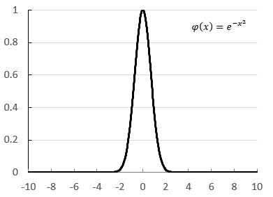
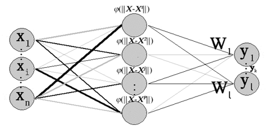

```{r setup, include=FALSE}
knitr::opts_chunk$set(echo = FALSE)
```

## 主要内容

* 神经元模型及神经网络模型

* 单层感知器

* BP神经网络

* RBF神经网络

* 网络设计与R代码实现

# 神经元模型及神经网络模型

## 发展史

* ANN的概念肇始于上世纪40年代，50年代在计算机上实现（1957年康奈尔大学的感知机）
* 从20世纪60年代到80年代的沉寂期，当时算法不成熟，而且计算量计算机无法承受
* 20世纪90年代随着计算机技术呈几何倍数的增长，人工网络的训练开始达到一定的规模
* 2010年以后，云计算的兴起使得同时使用成千上万台计算机成为可能，神经网络的处理能力和应用范围也有了进一步的发展

## google brain

谷歌大脑，谷歌大脑是Google X实验室一个主要研究项目。是谷歌在人工智能领域开发出的一款模拟人脑的软件，这个软件具备自我学习功能。Google X部门的科学家们通过将1.6万台电脑的处理器相连接建造出了全球为数不多的最大中枢网络系统，它能自主学习，可以称之谓“谷歌大脑”。

为什么选择神经网络而不是别的学习算法：

1. 人工神经网络可以在多维空间“画出”多种形状的模式分类边界
2. 算法非常稳定，几乎没有怎么变过――易学、长久
3. ANN的训练算法比较简单，容易实现并行

神经网络关键字：自主学习

## ANN定义

神经网络是由多个简单的处理单元彼此按照某种方式互相连接而形成的计算机系统，该系统通过对外部输入信息的动态响应来处理信息。

译自：MAUREEN CAUDILL (人工智能和神经网络专家)  
1989年出版的Neural Network Primer: Part I  
<center></center>

## 神经网络介绍

神经网络通过大量人工神经元连接成特定的结构对外界的信息进行处理，主要通过调整神经元之间的权值来对输入的数据进行建模，最终具备解决实际需求的能力。  

人工神经网络主要的两大功能是模式识别和数据拟合。神经网络良好的非线性性能能够很好的刻画各种非线性曲面从来带来良好的模式识别能力，而其出色的优化计算过程可以不错的解决各种函数拟合问题。  

  

## 神经元模型

神经网络中最基本的成分是神经元(neuron)模型，目前广泛使用的神经元模型是1943年心理学家McCulloch和数学家W.Pitts首先提出的M-P神经元模型。如图，每个神经元都是一个多输入单输出的信息处理单元，输入信号通过带权重的连接传递，和阈值对比后得到总输入值，再通过激活函数(activation function)的处理产生单个输出。

<center></center>

## 神经元模型数学表达式

用数学表达式对神经元模型进行抽象和概括：我们令$x_0=-1 , \omega_{0j}=\theta_j$，即：$-\theta_j=x_0 \omega_{0j}$，也就是说我们将阈值认为是一个下标为0的输入神经元处理，得到如下神经元模型（$n+1$个输入）的输出公式：
$o_j=f(net_j)=f(\sum_{i=1}^{n} \omega_{ij}x_i - \theta_j)=f(\sum_{i=0}^{n} \omega_{ij}x_i)$

其中：

* $o_j$---神经元$j$的输出信息
* $\omega_{ij}$---神经元$i$到神经元$j$的连接权值（这里将每个输入也看成是一个神经元）
* $x_i$---神经元$j$接收到的神经元$i$的输入信息
* $\theta_j$---神经元$j$的阈值
* $net_j$---神经元$j$的净输入

## 向量表示

为方便起见，可以将模型表示为权重向量$\mathcal{W_j}$和输入向量$\mathcal{X}$的点积，即：
$$\mathcal{o_j}=f(\mathcal{net_j})=f(\mathcal{X}^T \mathcal{W_j})$$  
式中：  

* $\mathcal{X}=(x_0,x_1,x_2,...,x_n)^T$  
* $\mathcal{W_j}=(\omega_{0j},\omega_{1j},\omega_{2j},...,\omega_{nj})^T$  
* $x_n=(x_n^1,x_n^2,...,x_n^p)^T$，$x_n(n \neq 0)$表示输入的第$n$个节点的变量，$x$的上标表示观测（也称作模式序号），共有$p$个观测（样本数是$p$）  
* $x_0=(-1,-1,...,-1)^T$共$p$个$-1$。

## 激活函数-阈值函数

神经元的输出，是对激活函数套用输入加权和的结果。  
神经元的激活函数f(x)使得神经元具有不同的信息处理特性，反映了神经元输出与其激活状态之间的关系。 这里我们涉及到的激活函数有：阈值函数(也称为阶跃函数)  

<center></center>

阈值函数是神经元模型中常用简单的一种，但是由于阈值函数具有不连续，不光滑等不太好的性质，因此实际应用中常用sigmoid函数作为激活函数

## 激活函数-Sigmoid函数

Sigmoid函数（简称S型函数）

<center></center>

## 人工神经网络模型

神经元模型按照一定的层次结构连接起来，就得到了神经网络。神经网络是对生物神经网络的抽象简化，可以按照不同的方法分类：按照网络结构不同，即信息传递方向不同，可以分为前馈型网络和反馈型网络。

<center></center>

## 学习方式

根据学习方式的不同，可以将神经网络分为有监督学习和无监督学习：

* 有监督学习为神经网络的输出结果提供一个期望结果，也就是说每个输出信号都对应一个监督信号，通过比较两个结果的误差循环对权值进行调整，直到误差达到期望的精度为止，使得输出值无限逼近期望值。

* 无监督学习通过不断的提供输入信息，发现信息流中存在的任何可能的模式或者规律。这个网络的自组织过程最终会使得网络能够对属于同一类的模式进行自动分类。

## 有监督学习规则

$$\mathcal{\Delta W_j}=\eta r (\mathcal{X},\mathcal{W_j},\mathcal{d_j})\mathcal{X}$$

<center></center>

# 单层感知器

## 感知器(Perceptron)

感知器（Perceptron）是一种具有单层计算单元的神经网络，只能用来解决线性可分的二分类问题。在高维空间中的模式分类相当于用一个超平面将样本分开。如果二类模式线性可分，则算法一定收敛。单层感知器的结构和功能都非常简单，在目前解决实际问题中很少被采用，但是由于其较易学习和理解，是研究其他网络的基础。

## 研究步骤

1. 理解结构，类似于之前的神经元模型，用于解决二分类线性可分问题，或者是线性函数逼近问题
2. 确定激活函数，这里常用的是单极性（或双极性）阈值函数：$sgn(x)=\left\{\begin{array}{ll} 1& \mbox{} x \geq 0 \\ 0& \mbox{} x<0 \end{array}\right.$ 
3. 确定输出的计算公式：$\mathcal{o_j}=\left\{\begin{array}{ll} 1& \mbox{} \mathcal{X^T W_j} \geq 0 \\ 0& \mbox{} \mathcal{X^T W_j} < 0 \end{array}\right.$
4. 确定权值调整公式：先要定义学习信号，这里学习信号定义为期望输出和实际输出的差：$r=\mathcal{d_j}-\mathcal{o_j}$。则权值调整公式为；$\mathcal{\Delta W_j}=\eta r (\mathcal{X},\mathcal{W_j},\mathcal{d_j}) \mathcal{X}=\eta \mathcal{X^T} (\mathcal{d_j}-\mathcal{o_j})$

## 学习算法步骤

* 1 观察输入向量，一般需要标准化，当量纲差别不大时不需要标准化。
* 2 初始化：
    + 选取学习率$\eta(0<\eta<1)$,$\eta$值太大会影响训练的稳定性、太小会降低收敛速度
    + 初始化权值向量$\mathcal{W_j}=(\omega_{0j},\omega_{1j},\omega_{2j},...,\omega_{nj})^T$, 设置为全零值或者较小的非零随机数
    + 设定精度控制参数$\epsilon$(相应的循环时精度控制变量$d=\epsilon+1$)
    + 设定最大迭代次数$M$

## 学习算法步骤

* 3 计算输出：输入样本$x^p=(-1,x_1^p,x_2^p,...,x_n^p)^T$,计算出节点$j$的实际输出$o_j^p$
* 4 根据选择的学习方法调整权值：$W_j=W_j+\eta X^p (d_j^p-o_j^p)$ 其中$d_j^p$是第$p$个样本在节点$j$的期望输出
* 5 循环调整权值直到满足收敛条件，终止循环。收敛条件是：
    + 误差小于某个预先设定的精度控制参数： $\mid d_j^p - o_j^p \mid < \epsilon$ (这里为了防止偶然因素导致的提前收敛，可以设定误差连续若干次小于$\epsilon$，为了防止算法不一定收敛而进入死循环), 或者是累积误差小于精度控制参数：$\sum_{p=1}^P (d_j^p - o_j^p)^2 < \epsilon$。
    + 迭代次数达到设定值$M$(可以两个条件混合使用)
    
## 手算例题

某单计算节点感知器有$3$个输入。给定训练样本：$X^1=(1,-2)^T$; $X^2=(0,1.5)^T$; $X^3=(-1,1)^T$。输入向量中需要加入第一个恒等于$-1$的分量。期望输出向量$d=(-1,-1,1)^T$。初始权向量：$W=(0.5,1,-1)^T$，学习率$\eta=0.1$，激活函数采用双极性阈值函数。  


## 计算结果

  
可见三次训练的直线与正确的分割直线还有一定的差距，但是是在逐步逼近，逼近的速度比较慢，可以选择大些的学习率η。同样也可以看到初始权值的选择同样会影响训练过程。

## R语言实现直线拟合

查看附带的R代码文件。实验结果如下：  

神经网络拟合出的结果：  

 x0       |    x1     |    x2     |   x3  
----------|-----------|-----------|----------
1.214151  | -0.1338744| 0.08713487| 0.8932678  

残差平方和：5.451775  
线性回归求出的结果：  

(Intercept) |      x1       |    x2     |      x3 
------------|---------------|-----------|------------
    1.19933 |    -0.17163   |   0.09712 |  0.92516  

残差平方和：5.380298

## 局限性及解决途径

* 仅对线性可分问题具有分类能力（这是最致命的一个缺陷）  
* 如果输入样本存在奇异样本（远远偏离一般数据的异常值），则训练时间较长  

解决途径：针对这些局限性，可以在输入层和输出层之间引入隐层，得到多层感知器。  
由于单层感知器得到的是直线、平面或者超平面，加入单隐层后，每个隐层节点及输入可以看成是单层感知器，所以隐层及输出可以看成是单层感知器的组合。  
也就是说，先得到多条直线、平面等，然后再组合形成凸域（凸域是指其边界上任意两点的连线均在域内）。凸域已经能很大程度的改善线性不可分问题。而当加入双隐层后，第二层隐层及输出相当于是凸域的组合，可以解决任意复杂的分类问题（已经过严格的数学证明）

## 不同隐层数感知器的分类能力


# BP神经网络

## BP神经网络介绍

上面提到的多层感知器可以很好的解决分类问题，但是单层感知器的权值调整算法无法运用到多层感知器中（无法确定隐藏层的期望输出）。而随着误差反向传播算法（Error Back Propagation, BP）的提出， 解决了多层神经网络的学习问题， 故人们称这种采用误差反向传播算法训练的多层神经网络称为BP网络。
BP网络的学习过程由信号的正向传播和反向传播两个过程组成：

* 正向传播时信号从输入层计算各层加权和经由各隐层最终传递到输出层，得到输出结果
* 输出结果与期望结果（监督信号）比较得到输出误差，误差反传是依照梯度下降算法将误差沿着隐藏层到输入层逐层反传，将误差分摊给各层的所有单元，从而得到各个单元的误差信号（学习信号），据此修改各单元权值

## 网络结构



## 其中的向量定义如下


## 研究步骤-输出

* 1 确定激活函数，BP网络的激活函数必须可微，一般采用Sigmoid函数或线性函数作为激活函数。这里隐层和输出层我们均采用Sigmoid函数：$f(x)=\frac{1}{1+e^{-x}}$且$f'(x)=f(x)[1-f(x)]$
* 2 计算输出：  
   对于隐层：  
  
   对于输出层：  
  
   向量表示：  
   $\mathcal{Y}=f(\mathcal{VX}), \mathcal{O}=f(\mathcal{WY})$
   
## 研究步骤-代价函数

* 3 权值调整：  
这里我们用代价函数E来描述网络误差，使用随机梯度下降（SGD，Stochastic Gradient Descent）策略， 以代价函数的负梯度方向对参数进行调整。每次只针对一个训练样例更新权值。这种算法被称作误差逆传播（error Back Propagation）算法，简称标准BP算法  

代价函数$E$:  
 

## 研究步骤-梯度下降反向调整权值

根据梯度下降策略，误差沿梯度方向下降最快，故应使权值的调整量与误差的梯度下降成正比，即：

* 对于输出层：  
   
* 对于隐层：  
   

其中$\eta \subset (0,1)$表示学习率，用来限制训练速度的快慢

## bp算法推导

 

## 学习算法步骤――标准化、初始化

* 1 观察输入向量，一般需要标准化，当量纲差别不大是不需要标准化。
* 2 初始化：
    + 选取学习率$\eta(0<\eta \leq 1)$
    + 对权值矩阵\mathcal{W}、\mathcal{V}赋初值（较小的非零随机数）
    + 根据循环训练的需要定义训练集内样本计数器$p=1$（全部样本训练完一次后归一）和训练次数计数器$q=1$（记录总的训练次数）,误差$E=0$（记录每次的训练误差）。给出训练需要满足的精度$E_{min}$,设定最大迭代次数$M$

## 学习算法步骤――计算

* 3 计算输出：输入当前训练样本$\mathcal{X}$，各层输出：
    + 隐层：$y_j=f(\sum_{i=0}{n} \nu_{ij} x_i)$
    + 输出层：$o_k=f(\sum_{j=0}^m \omega_{jk} f(\sum_{i=0}^n \nu_{ij} x_i))$
* 4 计算此样本输出误差：输入当前对应的期望输出$\mathcal{d}$,$E^P=\sqrt{\sum_{k=1}^l (d_k^P-o_k^P)^2}$
* 5 计算各层误差信号：输入当前对应的期望输出$d$, 各层误差信号
    + 输出层：$\delta_k=(d_k-o_k)o_k(1-o_k)$
    + 隐层：$\delta_j=(\sum_{k=1}^l \delta_k \omega_{jk})y_j(1-y_j)$

## 学习算法步骤――调整权重、循环

* 6 调整各层权重：
    + 输出层：$\omega_{jk}=\omega_{jk}+\eta \delta_k y_j$
    + 隐层：$\nu_{ij}=\nu_{ij}+\eta \delta_j x_i$
* 7 循环判断：
    + 判断样本是否训练完毕，样本量为$P$，$p$每次训练自加$1$直到$p=P$时计算网络总误差$E_{RME}=\sqrt {\frac {1}{p} \sum_{p=1}^{P} (E^p)^2}$, $E^p=\sqrt{\sum_{k=1}^l (d_k^p-o_k^p)^2}$ ,进行下一步判断
    + 判断$E_{RME}<E_{min}$，成立则结束，否则$E$清零、$p$初始化为1，从第一个样本重新开始新一轮的训练

## 学习算法步骤――流程图

 

## 拓展――累积BP算法

除了标准BP算法，还有另一种基于标准梯度下降（BGD，Batch Gradient Descent）策略的BP算法(累积BP算法). 相较于标准BP算法的对于每个样本都要回传误差调整权值，累积BP算法是在所有样本输入后计算总误差然后调整权值，总误差$E=\frac{1}{2P} \sum_{p=1}^P \sum_{k=1}^l (d_k^p-o_k^p)^2$ 。累积BP算法在样本数多的情况下学习速度快很多；而标准BP算法往往会获得较好的解

## 局限性

BP算法是对网络总误差梯度下降寻找最优解（最小值）来调整权值的过程，则总误差是关于权值的函数。既然是函数总会涉及到极小值和最小值点，变化极速和变化平缓的部分。算法的局限性如下:

* 多极小值点容易使训练陷入局部最小
* 在函数变化平缓的区域收敛速度会很慢，使得训练次数大大增加

在标准BP算法中，每个样本是随机输入的，可以降低网络陷入局部最优的可能性。当然也可以使用多组不同的初始权值训练多个神经网络，由于初始权值的选取能影响训练最终进入局部最小还是全局最小，故多次训练选取误差最小的解作为最终参数更有可能得到全局最小时的解

## 改进算法

* 增加动量项：由于在梯度下降过程中，随着梯度越来越小，权值更新越来越慢，此时可能出现因为梯度极速下降而造成的震荡，也可能出现因为梯度下降过缓而造成收敛过慢：
    + 引入上一次的权值调整作为调整项，使权值调整具有一定的惯性，含有动量项的权值调整表达式为$\Delta W(t)=\eta \delta X+\alpha \Delta W(t-1)$  
    $\alpha \subset (0,1)$ 称为动量因子。即此次权值的调整如果和上次方向相同会加速收敛，如果方向相反会减缓震荡。因此可以很好的提高训练速度
* 学习率在一定程度上限定了权值调整的快慢, 学习率调整也是先用大的学习率到震荡区域，这个区域包含极小值，然后再用小的学习率逼近极小值。学习率的增减通过乘以一个因子来实现

## RBF神经网络

RBF（Radial Basis Function, RBF）网络和BP网络一样都是非线性多层前向网络，在任何情况下可以互相代替。BP神经网络是一种全局逼近网络，学习速率相对慢些，不适合实时性等要求较高的场合。而RBF网络被证明对非线性网络具有一致逼近性，可以逼近任意的非线性函数，结构简单，并且具有很快的学习收敛速度。因此RBF网络有较为广泛的应用  

径向基网络是一种单隐层前馈神经网络，使用径向基函数作为隐层神经元的激活函数，而输出层则是隐层输出的线性组合。径向基神经网络可分为正则化网络和广义网络，广义RBF网络是由正则化网络稍加变化得到的，被应用的较多

## 径向基函数

径向基函数记为：$\Phi (\parallel X-X^p \parallel)$。其中$\parallel x \parallel$是指欧几里得范数， 常用$2$范数，即${\parallel x \parallel}_2= (\sum_{i=1}^n {\mid x_i \mid}^2)^{1/2}$，表示$x$向量的模，这里
$\parallel{X-X^p}\parallel$表示点$X$到$X^p$的距离，$X^p$称为径向基函数的中心。$\Phi$称为径向基函数，常用的径向基函数有高斯函数：$\varphi(r)=e^{- \frac {r^2}{2 \sigma^2}}$，如下图所示（图中$2\sigma^2=1$） 

<center></center>

## 正则化网络

正则化网络中，所有的输入样本作为径向基函数的中心$X^p$，即这里隐层节点数等于输入样本数$P$。各径向基函数选择统一的标准差$\sigma$，从隐层到输出层之间采用与权值向量$W$加权和的形式进行线性组合  
<center></center>

## 权值调整――目标输出

<center></center>

## 权值调整――算法

<center></center>

## 局限性和解决途径

* 正则化逼近性能依赖于足够多的训练样本，但是如果训练样本的样本量$P$过大，需要计算$P \ times P$ 矩阵的逆，网络计算量将大的惊人（通用矩阵相乘算法的复杂度是$O(P^3)$，优化算法的复杂度是$O(P^2.807)$ ），从而导致过低的效率甚至根本不可能实现。
* 另一个局限性是当一个矩阵很大时，它是病态矩阵的可能性就很高，也就是说$\Phi$中的一个微小扰动将对结果$W$产生很大影响。
* 这些问题的解决方案是减少隐层神经元的个数，使其阶跃输入维度数和样本量之间。此时求得的解是较低维度空间上的次优解。

## 广义BPF网络

* 广义RBF网络是针对正则化网络的局限性稍加变化得到的，主要体现在径向基函数的中心$t_j$及基函数标准差的选取上，而且在隐层加入了阈值参数来与基函数共同求加权和。广义RBF网络中隐节点的个数$M$远小于样本个数$P$，基函数的中心更多的由训练算法确定。
* 根据径向基函数中心确定方法的不同，对应有不同的学习策略，常见的有：随机选取固定中心；自组织选取中心；有监督选取中心。
<center></center>

## 手算案例

<center></center>

## 手算案例

<center></center>

## 手算案例

<center></center>

## 手算案例

<center></center>


